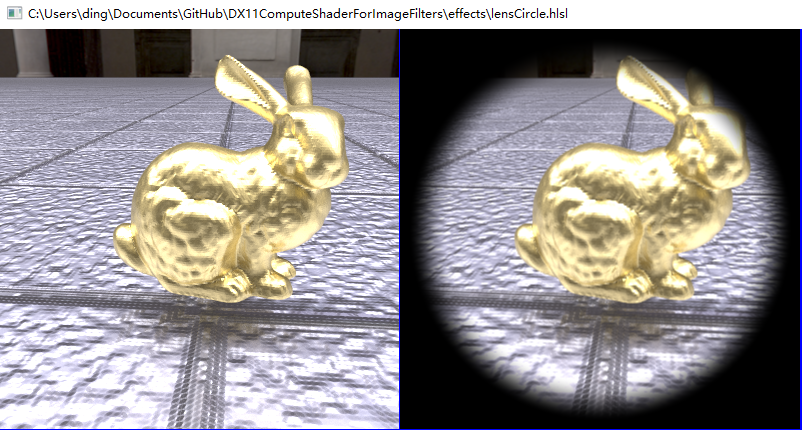
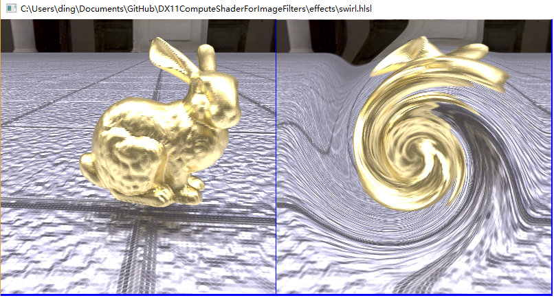
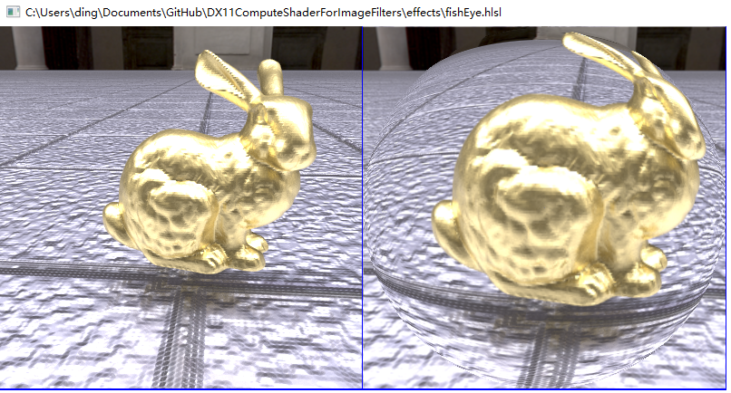

## DX11ComputeShaderFilter

9 Jan 2017 

## Overview
- It serves as an image post effect demo framework.
- It implements an Effects Viewer by **Compute Shader**.
- Effects are written with hlsl.
- Only DX11 is supported.
- It is tested on Window 10 with VS2015.

## Demo

Wating for update...

## Controls

- F1  : Navigate to next effect
- F2  : Navigate to previous effect
- F3  : Loop to next image
- ESC : Exit the application
- 'd' : Loop between different display mode
  - only display source image
  - only display result image
  - display both source and result image

- All images put in *image* folder are looped.
- All effects put in *effect* folder are looped.
  
## Assumption 
1. only apply one "pixel effect" to one image at one time.
1. just view "static effects", user is unable to adjust effect parameter.
1. all effects are one-pass effects. 

## Plan 
1. much more flexible design
1. add support to multipass-effects 
