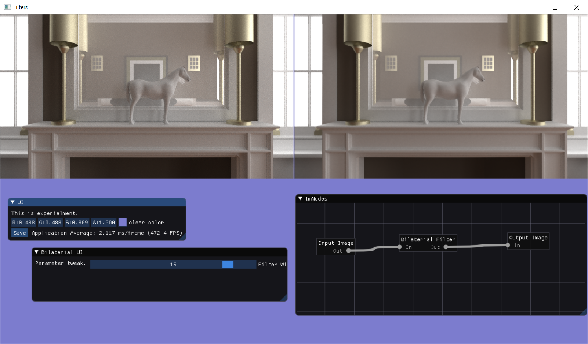

## Image Effects

9 Jan 2017 By ychding

It is an image filter viewing & testing framework.

## Overview
- ImGUI based UI.
- GHI(Graphic Hardware Interface) framework
- Node based data flow representation
- CMake build system.

## Screensnap

## Controls

- F1  : Navigate to next effect
- F2  : Navigate to previous effect
- F3  : Loop to next image
- ESC : Exit the application
- 'd' : Loop between different display mode
  - only display source image
  - only display result image
  - display both source and result image

- All images put in *image* folder.

 

